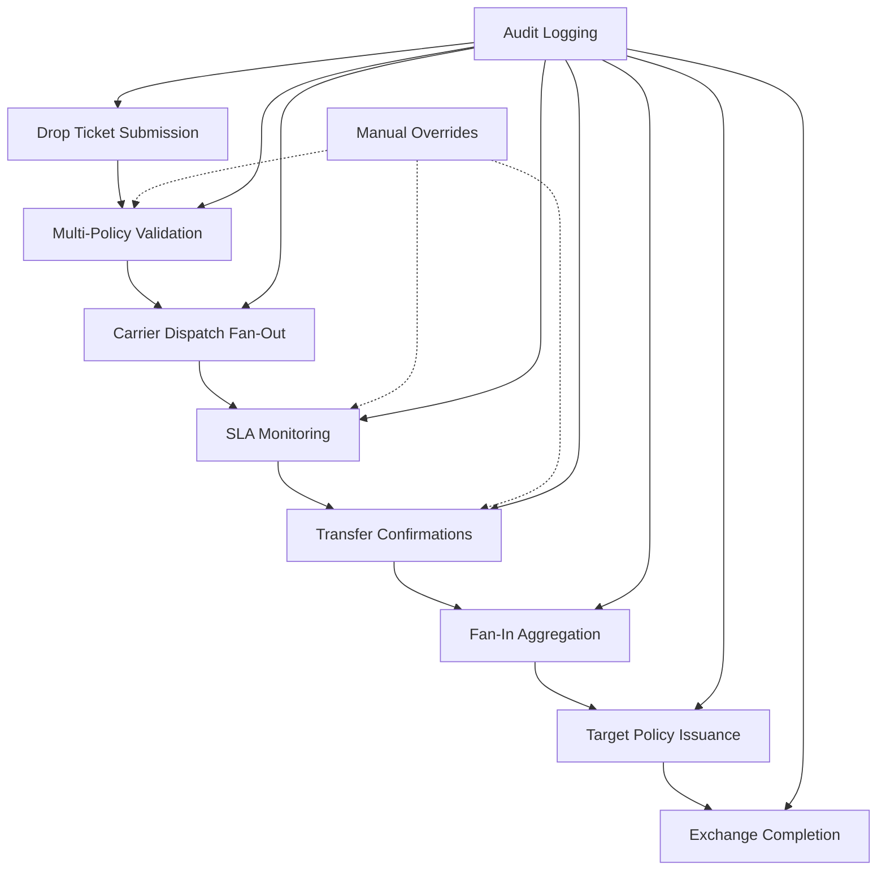

# 1035 Exchange Front-End Prototype
This was developed with [bolt.net](https://bolt.new/) and [a hosted demo is live NOW right HERE](https://moonlit-sunshine-3e45f7.netlify.app/).

This is an example of how to work with AI-powered rapid prototyping tools, including how to organize work using markdown files in the project. README.md, PRD.md, Design.md, Data.md, and Plan.md are each generated as intermediary content to guide the process.

## Marketing Landing Page Like a Real Product


## Admin Dashboard


## Create a new 1035 Exchange


## 1035 Exchange Details


# 1035 Exchange Workflow Management System

A comprehensive SaaS platform designed to streamline the IRS Section 1035 exchange process for insurance companies, focusing on the workflow executed by the receiving company. This application transforms the traditionally fragmented, manual process into a secure, trackable, and efficient digital workflow.

## 🎯 Overview

The 1035 Exchange Workflow Management System is a single-tenant application built for internal use by receiving insurance companies to manage the complete lifecycle of tax-deferred transfers between life insurance and annuity contracts. The platform provides real-time collaboration, comprehensive audit trails, and seamless integration capabilities.

### Key Value Propositions
- **Speed**: Reduce exchange cycle times by 50%+
- **Accuracy**: Lower NIGO (Not In Good Order) rates through structured workflows
- **Trust**: Secure collaboration across institutional boundaries
- **Compliance**: Built-in documentation for regulatory peace of mind

## 🏗️ Architecture & Domain Model

The application follows Domain-Driven Design (DDD) principles with event-driven architecture, organized into five core domains:

### 1. DropTicket Domain
**Root Aggregate** - Represents the complete 1035 exchange request lifecycle
- **Entities**: DropTicket, Owner, Insured, Agent, StatusTimeline
- **Capabilities**: 
  - Accept new drop ticket submissions
  - Coordinate validation for multiple source policies
  - Track progress independently per policy
  - Fan-in event handling for transfer confirmations

### 2. Policy Domain
**Individual Policy Management** - Handles source and target policy validation and tracking
- **Entities**: Policy, PolicyType, Carrier, PolicyStatus
- **Capabilities**:
  - Validate policy eligibility under §1035 IRS rules
  - Generate policy-level communication requests
  - Track status progression (Validated → Awaiting Carrier → Confirmed)

### 3. CarrierCommunication Domain
**External Integration Layer** - Manages all carrier interactions
- **Entities**: CarrierRequest, CarrierResponse, CommunicationChannel
- **Capabilities**:
  - Multi-channel communication (email, API, fax)
  - SLA monitoring and escalation
  - Retry logic and delivery confirmation
  - Webhook handling for carrier responses

### 4. ExchangeLifecycle Domain
**Orchestration & Analytics** - Provides system-wide coordination and metrics
- **Entities**: ExchangeState, LifecycleEvent, MetricsSnapshot
- **Capabilities**:
  - Aggregate lifecycle metrics
  - State transition management
  - Real-time analytics and reporting
  - Notification triggers

### 5. Audit & Exception Domain
**Compliance & Governance** - Ensures full auditability and manual intervention capabilities
- **Entities**: AuditLogEntry, OverrideAction, Justification
- **Capabilities**:
  - Complete audit trail logging
  - Manual override with justification
  - Exception handling and escalation
  - Compliance reporting

## 🔄 Core Workflow



## 🚀 Key Features

### Real-Time Collaboration
- Live dashboard with real-time updates
- In-app notifications for immediate awareness
- Legacy email integration for external communications
- WebSocket-based live updates

### Comprehensive Document Management
- Secure document upload and storage
- E-signature integration (DocuSign/similar)
- Automated form generation
- Version control and audit trails

### Advanced Analytics & Reporting
- Real-time exchange progress tracking
- SLA monitoring and breach alerts
- Cycle time analytics
- Carrier performance metrics
- Compliance reporting

### Security & Compliance
- SOC 2 Type compliance framework
- End-to-end encryption
- Role-based access control
- Complete audit logging
- Data retention policies

## 🔌 Integration Capabilities

### API-First Design
- RESTful API for all core operations
- Webhook support for real-time notifications
- Secure API authentication and authorization
- Rate limiting and throttling

### External Integrations
- **E-Signature Platforms**: DocuSign, Adobe Sign
- **Document Storage**: Secure cloud storage with encryption
- **Email Services**: Secure email delivery with tracking
- **Carrier APIs**: Direct integration where available
- **Identity Verification**: Support for KYC/AML processes

### Supported Communication Channels
- Secure email with delivery confirmation
- API-based carrier integration
- Traditional fax (where required)
- Secure messaging portal

## 🛠️ Technical Stack

### Frontend
- **Framework**: React 18 with TypeScript
- **Styling**: Tailwind CSS
- **Icons**: Lucide React
- **State Management**: React Context/Hooks
- **Real-time**: WebSocket integration

### Backend Architecture
- **Event-Driven**: Domain events for loose coupling
- **CQRS**: Command Query Responsibility Segregation
- **API**: RESTful with OpenAPI specification
- **Real-time**: WebSocket support for live updates

### Security & Compliance
- **Authentication**: Multi-factor authentication
- **Authorization**: Role-based access control (RBAC)
- **Encryption**: End-to-end encryption for sensitive data
- **Audit**: Comprehensive logging and monitoring
- **Compliance**: SOC 2 Type II framework

## 👥 User Roles & Permissions

### Agent
- Submit drop tickets
- View exchange progress
- Upload required documents
- Receive notifications

### Home Office Admin
- Review and approve drop tickets
- Validate carrier confirmations
- Apply manual overrides
- Access compliance reports

### Operations Staff
- Monitor SLA compliance
- Manage carrier communications
- Handle escalations
- Generate operational reports

### System Administrator
- User management
- System configuration
- Audit log access
- Integration management

## 📊 Key Metrics & KPIs

### Operational Metrics
- Average exchange cycle time
- NIGO (Not In Good Order) rates
- SLA compliance percentage
- Carrier response times

### Business Metrics
- Exchange volume trends
- Agent satisfaction scores
- Processing cost per exchange
- Compliance audit results

## 🔧 Development Setup

### Prerequisites
- Node.js 18+
- npm or yarn
- Modern web browser

### Installation
```bash
# Clone the repository
git clone [repository-url]

# Install dependencies
npm install

# Start development server
npm run dev

# Run linting
npm run lint

# Build for production
npm run build
```

### Environment Configuration
```env
# API Configuration
VITE_API_BASE_URL=https://api.example.com
VITE_WS_URL=wss://ws.example.com

# Integration Keys
VITE_DOCUSIGN_CLIENT_ID=your_docusign_client_id
VITE_SECURE_EMAIL_API_KEY=your_email_api_key

# Feature Flags
VITE_ENABLE_REAL_TIME=true
VITE_ENABLE_AUDIT_LOGGING=true
```

## 🗂️ Glossary

| Term | Description |
|------|-------------|
| **1035 Exchange** | A tax-deferred transfer of value from one insurance or annuity contract to another, subject to IRS eligibility rules |
| **Drop Ticket** | The initial intake form submitted by an agent that includes owner, insured, and source policies for exchange |
| **Source Policy** | An existing contract to be surrendered and replaced during the 1035 exchange |
| **Target Policy** | The new contract issued by the receiving carrier after the exchange is completed |
| **Carrier Dispatch** | The communication step where the request is sent to the source carrier using preferred protocols |
| **Transfer Confirmation** | The source carrier's signed approval to release value from a policy |
| **Fan-Out** | A pattern where a single event spawns multiple downstream events |
| **Fan-In** | A pattern where multiple related events are aggregated into a unified state change |
| **Override** | A manual administrative action used to bypass validation or correct a system state |

## 🎯 Roadmap

### Phase 1: Core Workflow (MVP)
- [ ] Drop ticket submission and validation
- [ ] Basic carrier communication
- [ ] Simple status tracking
- [ ] Essential audit logging

### Phase 2: Enhanced Features
- [ ] Real-time dashboard
- [ ] E-signature integration
- [ ] Advanced analytics
- [ ] SLA monitoring

### Phase 3: Advanced Integration
- [ ] Carrier API integrations
- [ ] Advanced reporting
- [ ] Mobile responsiveness
- [ ] Performance optimization

### Phase 4: Enterprise Features
- [ ] Advanced security features
- [ ] Compliance automation

## 📞 Support & Documentation

For technical support, feature requests, or questions about the 1035 Exchange Workflow Management System, please refer to the internal documentation or contact the development team.

---

*This application is designed to transform the traditional 1035 exchange process into a modern, efficient, and compliant digital workflow that benefits all stakeholders in the insurance ecosystem.*
